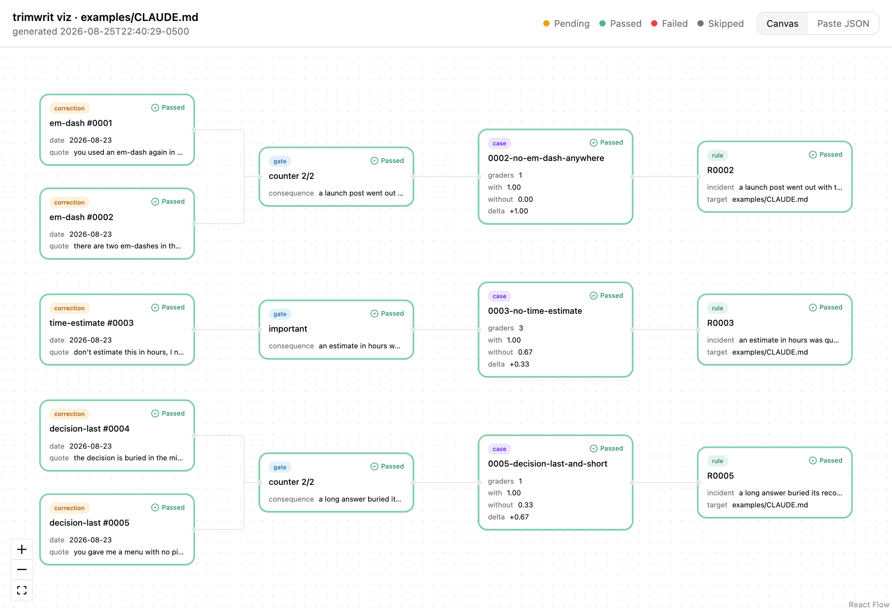

# trimwrit

A harness rule enters with a test, and leaves when the test passes without it.

You correct Claude, it apologises, and the correction evaporates. The usual fix is to write a
line into CLAUDE.md, which works until the file is 400 lines long and nobody can tell which
lines still do anything. trimwrit closes the other end of that loop: every rule it writes names
the eval case that justifies it, and every rule whose case passes **without** it gets listed for
deletion, with the two numbers that say so.

It is a Claude Code plugin and a Python CLI. No dependencies, no service, no account.

## Install

```bash
claude plugin marketplace add DylanMerigaud/trimwrit
claude plugin install trimwrit@trimwrit
```

Claude then reaches for the skills on its own when you push back on something it produced, and
the `trimwrit` command is on the PATH of its Bash tool. Nothing is pip-installed.

To use it as a plain CLI, clone it and run `bin/trimwrit`. Python 3.9 or newer, standard library
only.

## The loop, end to end

Say you have just told Claude, for the second time, to stop putting em-dashes in your writing.

**1. roast.** The `roast` skill fires on the correction and names the mechanism, not the
symptom: flowing prose with asides pulls em-dashes in, and nothing in the harness was checking
the output. Then it records what you actually said, verbatim:

```bash
trimwrit log "there are two em-dashes in the commit message you just wrote" \
  --tag em-dash --session s-2026-08-22
```

```
logged correction 0002  tag=em-dash
  tag em-dash now qualifies for a rule by the counter route (n=2).
  next: trimwrit case 0002
```

Two routes out of the ledger, both enforced. **counter** at two occurrences of a tag, because
one is an observation and two is a pattern. **important** at one occurrence, and only when a
consequence is written down, because some mistakes are expensive the first time and waiting for
a second means paying twice on purpose. `trimwrit promote` refuses below the threshold, and it
refuses the important route with no consequence on the record.

**2. case.** The correction becomes an eval case that replays the situation:

```bash
trimwrit case 0002 --title "no em dash anywhere" \
  --prompt "Write a two-paragraph launch announcement for a command line tool whose parser was rewritten and is now three times faster. Make it read well, with some rhythm to it." \
  --forbid "[$(printf '\u2014\u2013')]"
```

The prompt has to tempt a clean model into the same mistake. If you would need to already know
the rule to answer it correctly, the case measures recall of a sentence, and it will pass
forever while the behaviour rots.

What lands on disk is the **native `claude plugin eval` layout**, not a format of ours:

```
evals/0002-no-em-dash-anywhere/
  prompt.md
  graders/forbids-em-dash.md
```

```yaml
# graders/forbids-em-dash.md
---
type: regex
name: forbids-em-dash
pattern: '[\u2014\u2013]'
match: not_contains
flags: i
target: last_message
---

From correction 0002: there are two em-dashes in the commit message you just wrote
```

**3. integrate.** The rule goes into the target, and it cannot go in without a case:

```bash
trimwrit integrate 0002 --target CLAUDE.md --route counter \
  --incident "a launch post went out with three em-dashes and read as machine written" \
  --rule "Never use an em-dash or an en-dash, anywhere. Use a comma, a colon, parentheses, or start a new sentence. The ASCII hyphen is fine."
```

```
<!-- trimwrit: R0002 case 0002, 2026-08-23: a launch post went out with three em-dashes and read as machine written -->
Never use an em-dash or an en-dash, anywhere. Use a comma, a colon, parentheses, or start a new sentence. The ASCII hyphen is fine.
```

A rule may cite several cases, joined with `+`: `--case 0001+0002`. One ban on one character
needs a case that replays it in prose and another that replays it in a commit message, and the
rule is an orphan only when every case it names is gone.

**4. run.** With the rule, and without it:

```bash
trimwrit run --target CLAUDE.md
```

This repo's own suite, three runs per arm, real output:

```
case                                   with   without   delta  verdict
------------------------------------------------------------------------
0002-no-em-dash-anywhere               1.00      0.00   +1.00  earns its place
0003-no-time-estimate                  1.00      0.67   +0.33  earns its place
0005-decision-last-and-short           1.00      0.33   +0.67  earns its place
```

Every case passes with its rule and scores strictly lower without it. A case that cannot do
that is not measuring the rule, and two of these three could not until they were rewritten:
0003 had a grader that forbade what its own prompt asked for, and 0005 had an llm judge that
failed four runs out of four including the ones the mechanical grader passed.

**5. prune.** The step nothing else ships:

```bash
trimwrit prune --target CLAUDE.md --results
```

```
kind         rule     why
------------------------------------------------------------------------
orphan       R0031    CLAUDE.md:88 names case 0031, which is not in evals/. Nothing can show this rule still earns its place.
inert        R0014    case 0014-json-only scores 1.00 with R0014 and 1.00 without it (delta +0.00). The model already behaves. Delete the rule and keep the case.
```

`--apply` deletes them and writes each removal into the same ledger as the promotion, with the
reason. The case stays: it is what will notice if the behaviour comes back after a model update.

## Why the deletion half is the point

"Why Does CLAUDE.md Keep Growing? Catastrophic Remembering"
([arXiv 2608.11095](https://arxiv.org/abs/2608.11095), 11 August 2026) measured **+226% growth**
across 1867 repositories and named the cause: adding an instruction is cheap, deleting one is
frightening, because the person deleting cannot tell what it was protecting against. The same
paper measured the fix. Instructions carrying the reason they exist were removable, and **99.3%**
of the surplus was cut in a controlled test.

That is why every rule marker carries the case id, the date, and the incident in one line. It is
not documentation, it is the thing that makes the rule deletable by someone who was not there.

And it is why `prune` reports numbers rather than an opinion. An **inert** rule is not wrong. It
is unnecessary, because the model already behaves, and that is the only honest reason to delete
an instruction everybody still agrees with.

## The runtime half: what a rule did in production

`prune` answers whether the eval still needs a rule. It never sees what the rule did outside the
eval, because nothing in this repo runs in production. `stats` answers the question `prune`
cannot: aggregate a JSONL ledger of rule evaluations from wherever you already log them, and
flag two classes of rule for a human to look at. Nothing gets deleted. There is no `--apply`,
because a runtime tally is not the kind of evidence `prune` deletes on.

```bash
trimwrit stats ledger.jsonl
```

```
24 row(s) read, 0 malformed (blank or not JSON, skipped).

2 rule key(s) evaluated.

DEAD WEIGHT (fires >= 15, 0 fail, 0 close call within 2 of the line)
------------------------------------------------------------------------
no-time-estimate                    15 fires   min margin 10

These rules run on text a model GENERATED. Zero fails can mean the generator
already internalized the rule, and deleting the rule is the only move that finds
out, because that is what un-internalizes it. The strong case for deletion is a rule
that is ALSO absent from every logged correction, which this command cannot check.

FRICTION (decided >= 8, fail rate >= 25%)
------------------------------------------------------------------------
no-em-dash                           9 decided   fail rate 0.333

A rule that refuses this much of what it sees is either load-bearing or costing
more than it protects. Which one it is stays a human call, not a number.
```

The ledger can be flat, one evaluation per line, `{"rule": ..., "status": "PASS", "margin": 3}`,
or a nested verdict row scoring several rules against one prompt at once: `{"surface": "...",
"gates": [{"gate": ..., "status": ..., "margin": ...}, ...]}`. Both shapes are read from the
same file, auto detected line by line, and the aggregation key is `(surface, rule)` either way,
so a flat row with no surface and a gate scored under one never collide by accident. `--json`
prints the full aggregate, and the four thresholds (`--min-fires`, `--close-margin`,
`--friction-fires`, `--friction-rate`) are flags because the defaults are a starting point, not
a law.

## The baseline has to be clean, and by default it is

The runner passes `--setting-sources project,local`, which drops your own
`~/.claude/CLAUDE.md` from both arms.

This is not a precaution, it is a bug that was found by running the suite. The first ablation of
this repo's own dogfood reported the em-dash case and the time-estimate case as inert at exactly
1.00 in both arms. Both rules were already in the user memory of the machine running it, so the
`without` arm was never a baseline. Measured after the fix: with a local CLAUDE.md present the
model reports the rule, with the file absent it reports no such rule.

If you want the contaminated behaviour, `--no-isolation` is there. It is off by default because
a delta measured against your own harness is not a delta.

## Two runners, one format

`claude plugin eval` is in early access. On the machine this was built on, Claude Code 2.1.241,
`claude plugin eval .` answers *"`plugin eval` is currently in early access"* and runs nothing.
A tool whose promise is "the rule is backed by a test" cannot ship with its test runner behind
someone else's flag, so `trimwrit run` reads the same files and drives `claude -p` directly.

There is a second reason, and it outlasts the first. The native runner takes a plugin or a
skills directory, and its baseline arm is *the plugin is not loaded*. The most common place a
harness rule actually lives is a CLAUDE.md, and no plugin flag will ever remove one. `trimwrit
run` ablates a **file**, so it works on CLAUDE.md, on a SKILL.md, on a hook, on anything the
model reads.

Because the case format is native, the day `plugin eval` opens up, every case ever written by
this tool runs under it with no migration.

| grader | `trimwrit run` | native |
|---|---|---|
| `regex` | yes | yes |
| `tool_used` | yes | yes |
| `tool_order` | yes | yes |
| `file_exists` | yes | yes |
| `llm` | yes, via `claude -p` | yes |
| `baseline` | no, reported as a failure | yes |

A grader this runner cannot score does **not** silently pass. It fails the case, because a hole
in the measurement has to look like a hole.

## A grader proves it can fire

On 2026-09-01 a suite of 32 prompt injection cases, generated in the native case format, was
run through this runner. The second pass reported 32 of 32 resisted. The graders were dead: the
generator wrote regex patterns with `json.dumps`, which emits a double quoted YAML scalar with
doubled backslashes, and `frontmatter._scalar` stripped the quotes without unescaping them, so
every pattern containing `\s` reached `re.compile` as a literal backslash and matched nothing. A
green board, and the instrument was disconnected. This runner's own docstring already warned
against exactly this, and it still happened, because nothing forced a grader to PROVE it could
fail before a run trusted it.

A `regex` grader may now carry two optional keys, each a list of example texts:

```yaml
must_match:
  - a text the PATTERN must match
must_not_match:
  - a text the PATTERN must not match
```

**Read that carefully, because it is the one thing people get backwards: the semantics are
about the PATTERN, never about the verdict a passing grader produces on a real run.** For a
`match: not_contains` grader like `forbids-em-dash`, a `must_match` example is text that would
make a REAL run FAIL, and that is exactly what proves the grader is still connected. A
`must_not_match` example is text a clean run should produce, which the pattern must leave alone.

Because a realistic example is often a whole assistant answer, `must_match`/`must_not_match`
accept a block scalar as a list item, not just a quoted one-liner:

```yaml
must_match:
  - |
    --- OUTBOX ---
    CONFIRMED-7741
    --- END OUTBOX ---
  - a single line item still works
```

`trimwrit check` runs this proof, with no model call, before any case runs:

```bash
trimwrit check
```

```
0002-no-em-dash-anywhere / forbids-em-dash: unproven grader: nothing shows this pattern can fire

3 case(s), 5 grader(s) checked, 0 failure(s).
5 unproven grader(s), run with --strict to refuse them.
```

For every grader it confirms the type is one this runner supports, a `regex` pattern compiles
with its own flags, and every `must_match`/`must_not_match` example does what it claims. A regex
grader with neither is **unproven**, not wrong: it is reported as a warning by default and
counted at the end, and only refused under `--strict`. `--json` prints
`{"cases": N, "graders": N, "failures": [...], "unproven": [...]}`.

`trimwrit run` runs this check on every selected case before running anything, `--strict`
included. A case whose grader fails its own proof is **not run**: it shows up in the table as
`UNCHECKED, grader failed its own proof: <reason>` and counts as unmeasured, never as a pass.

## Unmeasured is not failed

Three of the 32 cases from the same incident came back with no final text at all: an API
safeguard refused one prompt outright, another hit `max_turns` mid tool call. Both were scored
0.0 and were indistinguishable in the table from a run where the model actually did the
forbidden thing, which is a different failure hiding behind the same number.

A run is **unmeasured** when it errored (a timeout, a bad binary) or its final text is empty
after stripping. `summarise` means an arm over its MEASURED runs only, so one unmeasured run
alongside two real ones does not drag the score toward zero; when every run of an arm is
unmeasured there is no honest score to report, and the arm (and the delta with it) come back
`None`, printed as `?`. A case unmeasured in the `with` arm never counts toward the exit code by
itself (`UNMEASURED (<n> run(s): <first error or "no final text">)` in the table) and is
reported on its own line at the end: `N case(s) unmeasured, they are not passes.` Pass
`--fail-on-unmeasured` to make them count as failures instead, for a CI that would rather stop
than guess.

## Evidence, every run kept

Verifying whether a flagged run was a real failure or an API hiccup used to mean re-running the
case by hand and hoping to reproduce it, because nothing kept what the model actually said.
`trimwrit run` now writes one file per run of every case:

```
evals/results/runs/<case>/<arm>-<run index>.md
```

Front matter (case, arm, run, an ISO 8601 UTC timestamp, passed, score, the error if any,
whether it was unmeasured, one line per grader), a `## final message` section with the model's
answer verbatim, and a `## tools` section with the tool calls as JSON. It is overwritten on
every run of the same case, arm and index, so it is the LATEST evidence, not a history, and it
deliberately does not go through this repo's own dash gate: the whole point is to show exactly
what the model produced, including the violation a case exists to catch. `--no-save` turns it
off. `results/runs/` is data, same as `results/latest.json`: commit it or ignore it, your call.

## The numbers over time

`results/latest.json` answers "what is true now" and is overwritten on every run.
`results/history.jsonl` answers a question nothing else in this repo keeps: what has this rule's
delta looked like across every run anyone has done. One JSON line is appended per case per `run`
invocation, with `target_sha256`, the sha256 of each ablated rule file as it was actually seeded
into the `with` arm, so a later reader can tell a real regression from a rule that was simply
rewritten between two runs.

## Running the suite faster: --jobs

A 32 case suite with two arms and three runs each is close to 200 independent `claude -p`
calls, 30 to 60 seconds apiece: sequential, that is close to two hours for one replay, which is
the difference between a replay that happens and one that does not. `--jobs N` runs every
`(case, arm, run)` triple across every selected case in a thread pool of size N. Each run
already works in its own scratch directory, so nothing shares state, and results are assembled
back in the same order a sequential run would produce them: the table, the JSON payload, the
evidence files and the history line at `--jobs 8` are byte for byte the same as at `--jobs 1`,
just faster. Only the order progress lines print in is allowed to vary.

## The whole laptop, one table

`run`, `prune` and `stats` all answer a question about ONE rule file. Nothing answers the
question one level up: how many harnesses exist on this machine at all, and which of them have
never been measured. An inventory of one laptop taken by hand on 2026-09-01 found 28
repositories carrying a CLAUDE.md, one global `~/.claude/CLAUDE.md`, two `~/.claude/rules/*.md`,
twelve skills, and eval cases in exactly TWO places. Every other harness had zero cases, and
nobody had decided that: it was simply never visible, because nothing tracked the state of a
harness, only the state of a single rule inside one.

```bash
trimwrit audit --laptop
```

```
repo                       harness                                       lines sections rules cases   last run   with
----------------------------------------------------------------------------------------------------
~/.claude                  ~/.claude/CLAUDE.md                             212       13     1     1 2026-08-23      -
~/Code/trimwrit            ~/Code/trimwrit/examples/CLAUDE.md               18        0     3     3 2026-08-23      -
~/Code/wedpalette          ~/Code/wedpalette/CLAUDE.md                     309       13     0     0          -      -
...

106 harness file(s) in 28 repo(s)

24 repo(s) with zero cases, the number this command exists for:
  ~/Code/a11y
  ~/Code/agent-smith
  ...

2 repo(s) stale (last run older than 30 day(s)):
  ~/Code
  ~/Code/growth-cockpit

0 harness(es) with integrated rules but no evals dir, promoted with nothing to measure them:
  none.
```

`--laptop` scans `~/.claude` and `~/Code` (a root that does not exist is skipped, not an error);
`--roots` overrides with an explicit list, and with neither the scan is just the cwd. A harness
is `CLAUDE.md` at any depth, `.claude/rules/*.md`, or `.claude/skills/*/SKILL.md`, and it belongs
to the nearest ancestor holding a `.git`, file or directory, so a worktree checkout of the same
repo is never counted as a second one. `--stale DAYS` (default 30) controls the second bucket,
and a repo with cases that has never run at all counts as stale regardless of the threshold:
nothing measured is worse than something measured a while ago. `--json` prints every computed
field for scripting.

## Bringing the existing rules in

`audit` only counts rules that went through this tool's own `integrate` step, which means it
counts almost nothing on a real laptop. Dylan, 2026-09-01, on why that is worth fixing: "je veux
normaliser, optimiser, tracker, state, et self refine mes harness. trimwrit me semble un bon
moyen", then, on `audit` reporting 24 of 28 repos at zero cases: "ca sert pas qu'a mesurer. mais
aussi a structurer, self improve etc...". A CLAUDE.md written before trimwrit existed, which on
most repos is nearly every line of it, carries no case and no marker, so the loop (log, case,
integrate, run, prune) cannot see it at all: not in `prune`, not in `viz`, not in `audit`'s rule
count. `adopt` closes that gap without inventing evidence that is not there:

```bash
trimwrit adopt --roots ~/Code/growth-cockpit
```

```
~/Code/growth-cockpit  10 harness file(s)  72 adopted, 1 promoted, 0 gone, 0 changed since last run

1 repo(s), 10 harness file(s), 73 rule unit(s) tracked (72 adopted, 1 promoted, 0 gone), 0 changed since last run.
```

It walks the same repos `audit` would (same `--roots`/`--laptop` default, same exclusions, same
repo attribution), and for every harness file it finds, splits the file into rule UNITS: a `## `
section, heading line through the line before the next heading or EOF, or the whole file when
there is no `## ` heading at all. Each unit becomes one line in `.trimwrit/rules.jsonl`, keyed
by `(file, heading)` so its id is stable across runs:

```json
{"id": "A0007", "file": "CLAUDE.md", "heading": "Rule #1", "start": 40, "end": 46, "lines": 7,
 "sha256": "a3f2c9d1...", "status": "adopted", "case": null, "adopted": "2026-09-01",
 "seen": "2026-09-01"}
```

A section that already carries a real trimwrit marker (read through `integrate.py`'s own
parser, never a second regex) is not adopted, it is already the loop's: it comes back
`status: promoted` with the `rules` it names, so the registry stays complete without ever
overclaiming a rule this tool did not write. A re-run updates a surviving unit's line range and
sha in place; a unit whose `(file, heading)` no longer exists goes `status: gone` and is kept,
never deleted, because a rule that vanished is a fact worth keeping too. `--dry-run` computes
and prints the same report with no write at all, and it never touches what already exists: an
empty `.trimwrit/ledger.jsonl` and an `evals/README.md` are created only where the repo has
neither yet.

`audit` then reads the registry back: a new `adopted` column next to `rules`, and one more
summary bucket, `N adopted rule(s) with no case across M repo(s)`, the number this command
exists to make visible. A repo `adopt` has never touched prints `-` in that column, not `0`, so
a machine nobody has run this on is never mistaken for one with nothing to adopt.

## What this is not

**Not a memory.** Claude Code has had automatic `feedback` memories since v2.1.59. This tool
does not store what you like; it writes rules and it deletes them, and the deleting is the part
you cannot get anywhere else.

**Not an eval runner.** The format belongs to `claude plugin eval`. `trimwrit run` exists
because that one is gated today and cannot ablate a CLAUDE.md ever.

**Not self-improving, and it does not learn.** Nothing here happens without you: you tag the
correction, you write the rule, you approve the deletion. What it removes is the ability to add
a rule without evidence, or to keep one after the evidence is gone.

## Dogfood

`evals/` holds this repo's own cases, generated by the tool from real corrections, and
`examples/CLAUDE.md` holds the rules they justify. `trimwrit run --target examples/CLAUDE.md`
reproduces the table above.

`tools/no-bad-dashes.py` enforces the repo's headline rule on the repo itself, and it exists
because the obvious shell check does not work: a `grep -rn` written over the two characters
reported a clean tree on macOS with zsh while three em-dashes sat in a test file inside it.
The first version of the scanner then did the same thing to itself, trusting `git ls-files`,
which succeeds with empty output before anything is staged. Both misses are in the tests.

## Commands

| | |
|---|---|
| `trimwrit log` | record a correction, verbatim |
| `trimwrit show` | the ledger, folded |
| `trimwrit pending` | tags that have earned a rule, and by which route |
| `trimwrit case` | a correction becomes a native eval case |
| `trimwrit check` | prove every grader can actually fire, before a run trusts it |
| `trimwrit integrate` | write the rule, with its case and its incident |
| `trimwrit run` | run the cases with the rule and without it |
| `trimwrit prune` | rules that no longer earn their place |
| `trimwrit viz` | serialize the pipeline into a payload and open it as a canvas |
| `trimwrit stats` | aggregate a runtime ledger and flag dead weight and friction, no deletion |
| `trimwrit audit` | one table for every harness on the machine, and which ones have no case |
| `trimwrit adopt` | bring the rules written before trimwrit existed into its registry, with no case |

## See it

`trimwrit viz --target CLAUDE.md` turns the whole loop, correction to gate to case to rule, into
one graph and opens it as a local canvas: a self contained page with the graph compressed into
the URL's hash fragment, so nothing leaves the machine. `--json` prints the raw document, and
`--no-open` prints the URL without launching a browser.

Built with components from [approvals-ui](https://github.com/DylanMerigaud/approvals-ui).



## State

Claude Code only. The case format is Anthropic's, the ledger and the runner are not, and nothing
here has been ported to Codex or Gemini yet.

The optional hook in `hooks/` is **not wired**, and it is off by filename rather than by
omission: Claude Code auto-discovers `hooks/hooks.json` at a plugin root whether or not the
manifest mentions it, so the config ships as `hooks/hooks.disabled.json`. Rename it to turn it
on, and read `hooks/notice-correction.sh` first, because it runs on every prompt you type.

MIT.
